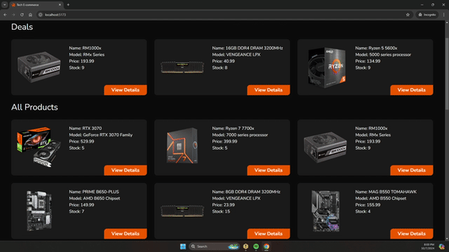

# Tech E-commerce



This project is a tech-focused e-commerce web application. It is built using **Vite** for fast development, **React** for the user interface, **Tailwind CSS** for responsive design, **React Router DOM** for navigation, and **Firebase** for authentication and database management.

## Features

- **Shopping Cart System:** Add and remove products from the cart.
- **Search and Filter System:** Browse products by categories.
- **Responsive Design:** Optimized for different screen sizes using Tailwind CSS.
- **Real-time Database:** Products and user data stored in Firebase Firestore.
- **Product Details Page:** View individual product details.

## Tech Stack

- **Vite:** Fast and lightweight build tool for modern web projects.
- **React:** JavaScript library for building user interfaces.
- **Tailwind CSS:** Utility-first CSS framework for fast UI development.
- **React Router DOM:** Declarative routing for React applications.
- **Firebase:** Backend services like authentication, Firestore database, and hosting.

## Installation

1. Clone the repository:

   ```bash
   git clone https://github.com/LautyPale/ecommerce-test
